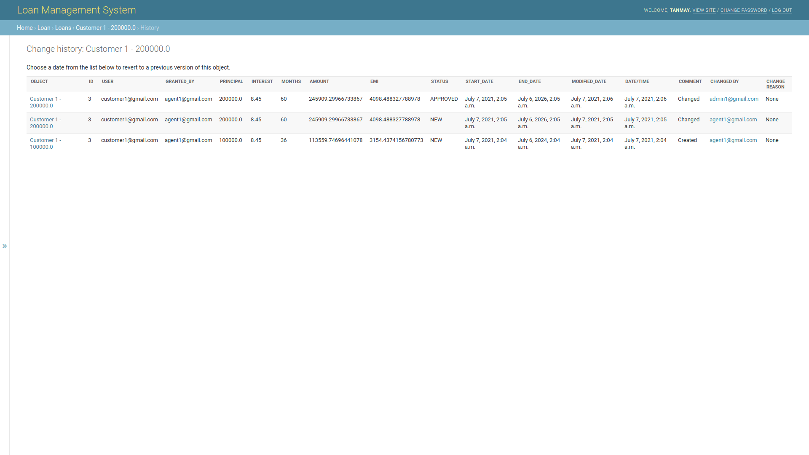

# Loan Management System

### API endpoints to a minimal loan management system.

### Technologies used:
1. Django
2. Django REST framework
3. PostgreSQL
4. Docker
5. Docker Compose

### Introduction to codebase:
1. [backend](./backend) : The API endpoints folder with all settings and configuration.
2. [Dockerfile](./backend/Dockerfile) : Dockerfile to build the image for the backend APIs.
3. [requirements.txt](./backend/requirements.txt) : Requirements file with all the necessary dependencies required to run the project.
4. [docker-compose.yml](docker-compose.yml) : YAML file configure the back end, and the database service.
5. [user](./backend/user) : App for user authentication and user roles and permissions.
6. [loan](./backend/loan) : App for the loan management of the users.

### Steps to run the projects:

**Pre-requites:**
1. python3.7 or greater
2. docker version 20.10.x
3. docker-compose version 1.29.x

**Steps:**
1. Navigate to the directory with [Dockerfile](./backend/Dockerfile) and use the following command:
```buildoutcfg
docker build --force-rm -t backend:latest .
```

2. Check your local docker image repository to see if the image has been built. Use command:
```buildoutcfg
docker images
```
3. Navigate to the folder with [docker-compose.yml](./docker-compose.yml).
4. To run migrations and set up the database, use commands:
```buildoutcfg
docker-compose run --rm apis python manage.py makemigrations user
docker-compose run --rm apis python manage.py makemigrations loan
docker-compose run --rm apis python manage.py migrate
```
5. To start the development server, use command:
```buildoutcfg
docker-compose up --remove-orphans
```
6. To shut the development serve, use command:
```buildoutcfg
docker-compose down --remove-orphans
```
**7. IMPORTANT: To test the backend with test cases, use command:**
```buildoutcfg
docker-compose run --rm apis python manage.py test
```
8. Create the first admin user of the system using command:
```buildoutcfg
docker-compose run --rm apis python manage.py createsuperuser
```

#### Key Points of the API:
1. There are 3 roles in the system - Customer, Agent, Admin.
2. Admins are the highest role available in the system and they can access the admin panel at http://127.0.0.1:8000/admin/ to view all data.
3. PBKDF2 algorithm with a SHA256 hash is used for hashing the password before storing it in the database.
4. [permissions.py](./backend/user/permissions.py) is used to set permissions of the user.
5. JWT is used to perform token authentication and the token is only valid for 2 hours after it's creation. This is to increase security of the system.
6. After 2 hours, a new token needs to be requested from the server.
7. Every API call is protected by permissions and authentication to ensure maximum safety.
8. History for "double safety" is being logged at every change made to a loan object. This can help us to rollback in extreme cases. Here is an example,

9. Filter by loan type is present.
10. Indian Standard Timezone is considered in the system and date handling is done accordingly.

#### Description of API endpoints:

#### NOTE: Please check Postman Published Docs link given above to see examples of all API endpoints.

* **Base URL : http:127.0.0.1:8000/api**
* **User APIs:**
    1. **Signup: /user/signup/**
        1. This endpoint can be used to sign up a user(customer or agent).
        2. Cannot signup if user already exists.
        3. Tokens have a validity of 2 hours only after which re-login is required.
        4. A user token is generated on successful registration.
        5. POST request has to be sent to this endpoint.
    2. **Create Admin: /user/create-admin/**
        1. This endpoint can be used by ADMINS ONLY to make more admin users.
        2. Authorization of admin level required to access this endpoint.
        3. POST request has to be sent to this endpoint.
    3. **Login : /user/login/**
        1. This endpoint can be used to log in by admin, agent or customer.
        2. Cannot log in agent if it is not approved by the admin.
        3. Admin and Customer can login using correct credentials directly.
        4. A user token is generated on successful login.
        5. Tokens have a validity of 2 hours only after which re-login is required.
        6. POST request has to be sent to this endpoint.
    4. **Profile : /user/profile/**
        1. This endpoint can display the user information depending on the authorization token present in the header.
        2. Authorization is required to access this endpoint.
        3. GET request has to be sent to this endpoint.
    5. **List Users(Agent) : /user/list-agent/**
        1. This endpoint can be used by AGENTS OR ADMINS to list the customers present in the system.
        2. Customer role cannot access this endpoint.
        3. Authorization required to access this endpoint.
        4. GET request has to be sent to this endpoint.
    6. **List Users(Admin) : /user/list-approvals/**
        1. This endpoint can be used by ADMINS only to list the customers and agents present in the system.
        2. Customer and Agent role cannot access this endpoint.
        3. Authorization required to access this endpoint.
        4. GET request has to be sent to this endpoint.
    7. **Approve or Delete and Agent : /user/approve-delete/<int:pk>/**
        1. This endpoint can be used by ADMINS only to list approve an agent to the system or delete one.
        2. Customer and Agent role cannot access this endpoint.
        3. Authorization required to access this endpoint.
        4. PUT request with <int:pk> i.e. agent ID as a URL parameter with is_approved status can be used to approve or reject an agent.
        5. DELETE request with <int:pk> i.e. agent ID as a URL parameter can be used to delete an agent.
* **Loan APIs:**
    1. **Request Loan by Agent for Customer : /loan/customer-loan/**
        1. This endpoint is for the agent to request a loan to the admin on behalf of a customer.
        2. Only Agent role can access this endpoint.
        3. Authorization required to access this endpoint.
        4. POST request has to be sent to this endpoint.
    2. **Approve or Reject a loan by admin : /loan/approve-reject-loan/<int:pk>/**
        1. This endpoint is for the ADMIN users only to accept or reject a loan request.
        2. Customer and Agent role cannot access this endpoint.
        3. Authorization required to access this endpoint.
        4. PUT request with <int:pk> i.e. loan ID as a URL parameter and status in the body can be used to approve or reject a loan.
    3. **Edit Loan by agent : /loan/edit-loan/<int:pk>/**
        1. This endpoint is for the AGENT role only to edit loan details for a user.
        2. Authorization required to access this endpoint.
        3. PUT request with <int:pk> i.e. loan ID as a URL parameter and new loan details in the body can be used to edit a loan.
        4. If loan is already approved, then edit is not allowed.
    4. **List Loans of all customers to Admins and Agents : /loan/list-loans-admin-agent/**
        1. This endpoint can be used by agents and admin users to list all loans in the system.
        2. Customer role cannot access this endpoint.
        3. Authorization required to access this endpoint.
        4. GET request has to be sent to this endpoint.
        5. Filters available:
            1. status?=NEW
            2. status?=APPROVED
            3. status?=REJECTED
        6. For example:
            1. For only one of the filters use: http://localhost:8000/api/loan/list-loans-admin-agent?status=APPROVED
    5. **List Loans of a particular Customer : /loan/list-loans-customer/**
        1. This endpoint can be used by customers to list their loans in the system.
        2. Authorization required to access this endpoint.
        3. GET request has to be sent to this endpoint.
        4. Filters available:
            1. status?=NEW
            2. status?=APPROVED
            3. status?=REJECTED
        5. For example:
            1. For only one of the filters use: http://localhost:8000/api/loan/list-loans-admin-agent?status=APPROVED